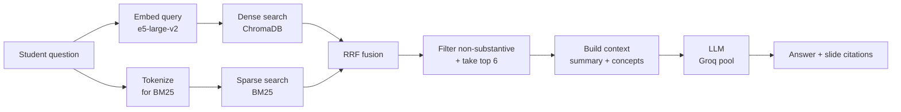
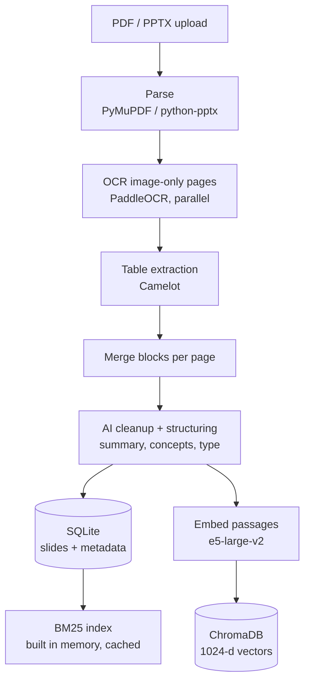

# ExamPrep AI — the AI/RAG track

> A guided tour of how ExamPrep AI actually finds and answers things.
> Read it top to bottom once and you should be able to explain the whole
> retrieval and generation stack without opening the code.

Every number in this document comes from an experiment in `experiments/`.
Where something was **not** measured, it says so.

---

## 1. What problem does ExamPrep AI solve?

A student has 15 lecture PDFs, 690 slides, and an exam in four days. They do not
need "a chatbot". They need answers to three questions:

1. *Is this topic even in my slides?*
2. *Which slide covers it?*
3. *What does it actually say?*

You could paste slides into ChatGPT. Two things break:

- **Scale.** 690 slides do not fit in a chat window, and you do not know which
  ones to paste — that is the problem you are trying to solve.
- **Provenance.** ChatGPT will confidently answer from its training data. For an
  exam you need *"page 62 of CH2.pdf says this"*, because the exam is set from
  the slides, not from the internet.

So the system must **search the student's own material first, then answer only
from what it found.** That is RAG, and provenance is the entire point.

---

## 2. The AI architecture, end to end



Two retrievers run, their rankings are fused, the top few slides become text in
a prompt, and an LLM writes the answer. Every arrow is a design decision with a
trade-off, and the rest of this document is those trade-offs.

---

## 3. Ingestion — turning a PDF into something searchable

Nothing can be retrieved until it has been parsed, cleaned, described and
indexed. This runs **asynchronously** (see the systems doc) because it takes
minutes, not milliseconds.



### The stages, and why each exists

| Stage | What it is | Why we need it | Without it | Drawback |
|---|---|---|---|---|
| **Parse** | Pull text and layout out of the file | Everything downstream needs text | Nothing works | Slide decks exported as images yield nothing |
| **OCR** | Read text out of images | Many lecture slides *are* images | Those slides are invisible to search | Slow; OCR errors propagate everywhere |
| **Tables** | Detect and extract tables | Tables carry dense exam-relevant facts | Tables flatten into word soup | Detection is imperfect |
| **AI cleanup / structuring** | An LLM writes a `summary`, `concepts`, `slide_type` per slide | Raw slide text is fragmentary — bullet stubs, headers. A summary is what actually gets embedded and shown | Retrieval quality drops sharply | **One LLM call per slide** — this dominates ingestion time |
| **Embeddings** | Turn text into a 1024-dim vector | Enables meaning-based search | Only exact word matching | GPU-bound; model-specific |
| **ChromaDB** | Stores vectors + metadata, does similarity search | You need fast nearest-neighbour over 690+ vectors | You would scan everything | Another moving part |
| **BM25** | Classic keyword index | Catches exact terms embeddings miss | Acronyms and rare terms get lost | Rebuilt in memory; no fuzzy matching |
| **SQLite** | Slides, documents, jobs, PYQ data | Durable source of truth and job state | No history, no recovery | Single-writer |

### The measured bottleneck — and it is not what people guess

From `experiments/reports/Q8-Q9-coverage-gate-and-ingestion.md`, profiling the
indexing half over all 690 real slides:

| Stage | Time | Share |
|---|---|---|
| Embedding | 46.6 s | **95.4%** |
| ChromaDB writes | 1.9 s | 3.8% |
| SQLite writes | 0.25 s | 0.5% |
| BM25 build | 0.12 s | 0.2% |

And against the stage that dominates everything: **AI cleanup is ~25× all of
those combined** (one LLM call per slide at a measured 0.56 requests/second).

> **Interview line:** "People assume the database is the bottleneck. I measured
> it — SQLite is 0.5% of indexing and the LLM is 25× everything else. Optimising
> the database would have been wasted work."

---

## 4. Hybrid retrieval — why two retrievers

### Dense retrieval (embeddings)

An embedding model maps text to a vector so that *similar meanings land near
each other*. "How does TCP avoid congestion?" lands near a slide about
congestion control even if the slide never uses the word "avoid".

ExamPrep AI uses **`intfloat/e5-large-v2`** (1024 dimensions, 24 transformer
layers). e5 models need instruction prefixes — `query: ` for searches and
`passage: ` for documents — because they were trained that way. Drop the prefix
and quality degrades.

**What dense retrieval is bad at:** rare exact tokens. Ask for `FIQ` and the
embedding of a three-letter acronym is a vague point in space near lots of
things.

### Sparse retrieval (BM25)

BM25 is keyword matching, refined. Two ideas:

- **Term frequency** — a slide mentioning "congestion" six times is probably
  about congestion.
- **Inverse document frequency (IDF)** — a word appearing in *every* slide
  ("the", "slide") carries no signal; a word in *one* slide ("jazelle") is
  enormously informative.

**What BM25 is bad at:** synonyms and paraphrase. Ask about "avoiding network
overload" and a slide titled "congestion control" scores zero.

### So: they fail in opposite directions

| Query | Dense | BM25 |
|---|---|---|
| "how does TCP avoid overload?" | ✅ finds congestion control | ❌ no shared words |
| "FIQ" | ❌ vague | ✅ exact rare token |

That is the whole argument for hybrid — and it is **measured**, from
`experiments/reports/G2-fusion-context-routing.md` over 114 questions:

| Retriever | Recall@1 | MRR |
|---|---|---|
| Dense only | 0.640 | 0.687 |
| Sparse only | 0.640 | 0.696 |
| **Hybrid (RRF)** | **0.667** | **0.723** |

Each alone gets 0.640. Together, 0.667. Neither is redundant.

---

## 5. RRF — and the most important insight in this project

### How it works

Reciprocal Rank Fusion combines two ranked lists **using only rank, not score**:

```
score(doc) = Σ over each retriever  1 / (K + rank_in_that_list)     K = 60
```

A slide ranked #1 by both retrievers gets `1/61 + 1/61 = 0.0328`.
A slide ranked #1 by one only gets `1/61 = 0.0164`.

**Why use rank instead of score?** Because a cosine distance and a BM25 score
are not comparable — different units, different ranges, different distributions.
Normalising them is fiddly and corpus-dependent. Ranks are always comparable.

Here is the production fusion, from `engine/tools.py`:

```python
for key in all_keys:
    score = 0.0
    d_rank = dense_map.get(key)
    s_rank = sparse_map.get(key)
    if d_rank is not None:
        score += 1.0 / (RRF_K + d_rank)
    if s_rank is not None:
        score += 1.0 / (RRF_K + s_rank)
```

Then a **deterministic** sort, which matters more than it looks:

```python
fused.sort(key=lambda x: (-x["rrf_score"], x["doc_id"], x["page_number"]))
```

RRF ties are *structural* — a slide found only by dense at rank `i` scores
exactly the same as one found only by sparse at rank `i`. Python's sort is
stable, so without an explicit tie-break the order depended on set iteration
order, which depends on `PYTHONHASHSEED`. **The same query returned different
results in different processes.** Breaking ties on `(doc_id, page_number)` makes
it reproducible.

### 🔑 RRF score is NOT a confidence score

This is the single most transferable lesson from the project.

It is tempting to read `rrf_score = 0.0328` as "the system is confident". It is
not. Look at the formula: the top result scores `1/61` or `2/61` **regardless of
whether the match is perfect or absurd**. Rank 1 is rank 1 even when every
candidate is garbage.

We proved it. From `experiments/reports/Q1-Q3-real-query-evidence.md`, we
replayed 31 real user queries through the production coverage check:

| Query | Subject | RRF top-1 | Verdict shipped |
|---|---|---|---|
| "kaju katli" (an Indian sweet) | Machine Learning | 0.01639 | **covered ✅** |
| "Linear Algebra" | Computer Networks | 0.02874 | **covered ✅** |

`covered=true` for **31 of 31 queries**. The `"low"` confidence branch is
*mathematically unreachable* for any rank-1 hit, because the minimum possible
rank-1 score (0.0164) is already above the 0.015 threshold.

The signal that *does* separate them was being thrown away: the raw cosine
distance. Nonsense queries sat at 0.206–0.299, real questions at 0.125–0.163.

> **Interview line:** "I found a confidence gate in production that was
> mathematically incapable of returning low confidence. RRF scores a rank, so
> the top result always scores the same. The fix isn't a better threshold — it's
> understanding that rank-based fusion deliberately discards the magnitude you'd
> need."

---

## 6. The RAG pipeline, concretely

```
"How does TCP switch from slow start to congestion avoidance?"
   │
   ├─ embed with "query: " prefix        → 1024-dim vector
   ├─ ChromaDB nearest neighbours        → 18 candidates (subject-filtered)
   ├─ BM25 over this subject's slides    → 18 candidates
   ├─ RRF fuse + deterministic sort      → ranked list
   ├─ drop non-substantive slides        → (title pages, index pages)
   ├─ take top 6                         → CONTEXT_MAX_SLIDES
   ├─ format into prompt text            → summary + concepts per slide
   ├─ Groq LLM                           → prose answer
   └─ answer + slide references
```

Two details worth knowing:

**Subject filtering happens in the vector search**, not after. A CN question
never sees DBMS slides. That is a metadata filter in ChromaDB.

**Context is capped at 6 slides.** Measured trade-off:

| Context | Gold slide present | ~tokens |
|---|---|---|
| top 3 | 0.763 | 378 |
| top 5 | 0.816 | 624 |
| **top 6 (production)** | **0.842** | 743 |
| top 10 | 0.860 | 1213 |

Going 6 → 10 buys 1.8 points of recall for 63% more tokens. Six is a defensible
knee in the curve.

---

## 7. Grounding — a correct answer can still be a bad answer

**Grounding** means: every claim in the answer is supported by the evidence you
supplied. It is *different from correctness*.

An answer can be:

- **correct and grounded** — says what the slide says ✅
- **correct but ungrounded** — true, but the model knew it already and the slide
  never said it ⚠️
- **incorrect** ❌

The middle case is the dangerous one for exam prep, because the student assumes
they are reading *their syllabus*.

### What we measured

From `experiments/reports/G1-answer-grounding.md`, 45 graded answers:

| | |
|---|---|
| Correct when the gold slide reached the LLM | **96%** (1 failure in 24) |
| Answers fully grounded | **8 / 30** |
| Answers with ≥1 unsupported claim | **25 / 30 (83%)** |
| Absent-topic questions answered anyway | **5 / 15 (33%)** |
| Citations naming files that do not exist | **3** |

Two structural causes, both visible in the code:

**1. Only summaries reach the model.** `_build_context` passes `summary` and
`concepts` — never `raw_text`. So the answer is grounded in *an LLM's summary of
a slide*, not the slide. An error introduced at ingestion is invisible to every
retrieval metric downstream.

**2. The prompt asks for confidence.** From `engine/fast_mode.py`:

```
- Never say "Based on the data provided" or "According to the slides shared"
- Speak with authority as if you studied the material yourself
```

There is no permission to say "this isn't in your slides". The prompt is tuned
for fluent prose, which is exactly when ungrounded claims are hardest to spot.

### Citation hallucination

Asked about topics absent from the corpus, the model invented sources:

```
"page 23 of sdn_chapter.pdf"     ← no such document
"page 12 of cap_theory.pdf"      ← no such document
```

**Why this is possible:** the citation is free text in prose. Nothing in the
architecture constrains it to a document that was actually supplied.

**The fix shape** (evaluated in `experiments/rag/h1_grounding_variants.py`):
label the supplied sources `[S1]…[S6]`, tell the model to cite only those
labels, and have the backend map a label back to the real file and page. A
citation to something that was not supplied becomes *unrepresentable* rather
than merely discouraged — and any stray label is mechanically detectable.

> **Interview line:** "Correctness was 96% when retrieval worked. The real
> problem was that 83% of answers contained claims the slides never made, and
> the model invented filenames. That's an architecture problem — the model
> could name any file it liked because citations were free text."

---

## 8. What should happen when the evidence is insufficient?

Currently: the system answers anyway, one third of the time, with citations.

Fixing this is harder than it sounds, and we rejected three obvious approaches.

### ❌ Threshold the dense distance

The intuition is good — nonsense queries genuinely sit further away. It survived
cross-validation at 0.941 balanced accuracy on constructed data.

Then we replayed **real** user queries. From
`Q1-Q3-real-query-evidence.md`:

| | Median words | Distance p50 |
|---|---|---|
| Generated eval questions | 13 | 0.1371 |
| **Real student queries** | **5** | **0.1793** |

Real queries are short, and short queries sit further from the corpus. At the
fitted threshold, **52% of genuinely answerable real questions would have been
refused.** Unshippable.

### ❌ Threshold the RRF score

See §5. It is a rank. It carries no confidence information at all.

### ❌ Make agentic RAG the default

Measured in `G3-G7-agentic-iterative.md` — see §9. It was worse at answering.

### ⚠️ The one promising signal

An agent that searches, inspects results, and decides declined **75%** of
absent-topic questions where the baseline declined **0%**. We tested whether
that was just its prompt (which grants permission to decline) by adding that
sentence to the production prompt: the decline rate stayed at **0/4**. So the
advantage appears architectural.

But n=4. It is *suggestive, not proven*, and it is the top item to re-measure.

> **Interview line:** "Every threshold we tried worked on constructed data and
> failed on real queries. The lesson wasn't 'find a better threshold' — it was
> that our evaluation set didn't look like our users."

---

## 9. Agentic AI — what we actually tested

Three systems, identical hard queries, same model:

| | Control loop | LLM calls |
|---|---|---|
| **Baseline** | none — retrieve, answer | 1 |
| **Iterative** | *deterministic*: if retrieved slides miss ≥34% of query terms, re-retrieve on the missing ones | 1 |
| **Agentic** | LLM emits `SEARCH:` / `ANSWER:`, up to 3 searches, sees results between turns | 3 |

Results:

| System | Correct | Grounded | Citations | Tokens | Paired record |
|---|---|---|---|---|---|
| baseline | **1.53** | **2.00** | **3.0** | 1.00× | — |
| iterative | 1.47 | 1.94 | 3.6 | 1.19× | 0 better, 1 worse, 16 tied |
| agentic | 0.94 | 0.94 | 0.1 | **2.36×** | **1 better, 9 worse, 7 tied** |

**Agentic RAG lost 9 of 17 head-to-head and cost 2.36× the tokens.** It was
*worse* on the multi-slide questions that were its best a-priori case, and it
nearly stopped citing slides at all — which for a study tool is its own failure.

**Where agentic behaviour might still earn its place:** as a *detector*, not a
generator. The architecture is good at noticing it has nothing and bad at
everything else. A narrow "is this answerable?" check is a different problem
from full agentic answer generation.

---

## 10. Evaluation — the metrics, and what they mean

| Metric | Plain meaning | Why we care | Reading it |
|---|---|---|---|
| **Recall@K** | Is the right slide in the top K? | If it isn't, the LLM cannot possibly answer well | R@1 0.667 = two-thirds of the time the very first result is right |
| **Gold-in-context** | Did the right slide survive into the prompt? | This is the actual ceiling on answer quality | 0.842 at top-6 |
| **MRR** | Average of 1/rank of the first correct hit | Rewards ranking it *first*, not just *somewhere* | 0.723 ≈ typically rank 1–2 |
| **nDCG@5** | Ranking quality with position discounting | Handles multiple relevant slides | 0.717 |
| **Answer correctness** | Does it match the reference? (0–2) | The user-facing outcome | 1.96/2 when gold was in context |
| **Groundedness** | Is every claim traceable to the context? (0–2) | Catches confident invention | 1.10/2 — the weak spot |
| **Unsupported claims** | Count of assertions absent from context | Direct hallucination measure | 97 across 30 answers |
| **Citation correctness** | Does the cited source exist and was it supplied? | Provenance is the product | 3 fabricated filenames found |
| **Abstention / decline rate** | Does it refuse when it should? | 33% currently answer absent topics | baseline 0%, agentic 75% |
| **Latency** | Wall-clock | User experience | retrieval ~95 ms, LLM 1.3–12 s |
| **Tokens** | Prompt + completion | Cost | agentic 2.36× baseline |

### How to think about evaluation methodology

Three rules learned the hard way in this project:

**1. Never label your data with the signal you are testing.** To test whether
dense distance detects absent topics, absence was verified **lexically** — does
the term appear zero times in the slide text? Labelling with distance would have
guaranteed the answer.

**2. Your evaluation set has a house style.** Every conclusion from constructed
questions weakened when tested on 40 real instructor-written exam questions, and
weakened again on 31 real student queries. Each time the evaluation got more
realistic, measured performance fell.

**3. Assert your experiment actually ran.** One experiment reported
`llm_calls: 0.26` — every API call had been rate-limited and a helper silently
returned an empty string. It produced a clean-looking table that measured
nothing.

---

## 11. Experiments that FAILED — the most useful section

| Hypothesis | Experiment | Result | Decision |
|---|---|---|---|
| **Cross-encoder reranking** improves ranking | Rerank fused candidates | Quality *down*, latency *up* | ❌ Rejected |
| **Query rewriting** (strip filler) improves retrieval | 5 deterministic rewrites, paired bootstrap | Looked established (P>99.9%) on our data; **zero effect** on independent exam questions | ❌ Rejected — the gain was removing filler *we had written into the test set* |
| **Conditional retry** beats always-rewriting | 4 policies × 5 triggers × 3 budgets | Worse at every setting | ❌ Rejected — you cannot threshold a mixture of two distance scales |
| **Weighted fusion** beats RRF | Weighted sum of normalised scores | Ties at best | ❌ Rejected |
| **Tuning RRF K** helps | K from 1 to 120 | Flat 5→120 | ❌ Rejected — don't waste time here |
| **Bigger candidate pool** helps | fetch_n 5 → 120 | Completely flat | ❌ Rejected |
| **Adjacent slides** add context cheaply | top-6 + neighbours | Same recall as plain top-10 for 40% more tokens | ❌ Rejected |
| **Dense-distance abstention** is shippable | CV, then real queries | 0.941 on constructed data; **52% false refusals** on real queries | ❌ Rejected |
| **Agentic RAG** improves hard queries | 3 systems, 17 hard queries | Lost 9 of 17, 2.36× cost | ❌ Rejected as default |
| **Query-length routing** helps | Paired McNemar + bootstrap | Effect is *real* (CI [+0.020, +0.297]) but worth **+3 questions of 114** | ❌ Rejected — real ≠ worth shipping |
| **fp16 / CPU / keep-warm** speed up embedding | 7 candidates | Embedding is *launch-bound*, not compute-bound | ❌ All rejected |

That last row is worth a sentence: query embedding takes ~20 ms when the GPU is
busy and ~75 ms when it has gone idle, because the GPU drops to 600 MHz from a
2100 MHz maximum. Quantisation cannot help something that is waiting, not
computing.

> **Interview line:** "The most valuable result I got was a negative one. A
> bootstrap said my query-rewriting improvement was established with 99.9%
> confidence. It vanished completely on an independently built evaluation set,
> because the 'improvement' was removing filler text I had written myself. The
> arithmetic was right; the question was too narrow."

---

## Where to verify any of this

| Claim | Artifact |
|---|---|
| Hybrid beats either retriever | `experiments/reports/G2-fusion-context-routing.md` |
| RRF is not confidence | `experiments/reports/Q1-Q3-real-query-evidence.md` |
| Grounding failure modes | `experiments/reports/G1-answer-grounding.md` |
| Agentic comparison | `experiments/reports/G3-G7-agentic-iterative.md` |
| Real-query distribution | `experiments/reports/Q1-Q3-real-query-evidence.md` |
| Ingestion profile | `experiments/reports/Q8-Q9-coverage-gate-and-ingestion.md` |
| Embedding latency | `experiments/reports/Q6-Q7-embedding-latency.md` |
| Overall status | `experiments/reports/PROMOTION-CHECKPOINT-rag-v4.md` |

Next: [`SYSTEM-DESIGN.md`](SYSTEM-DESIGN.md) for the backend, and
[`INTERVIEW-QUESTIONS.md`](INTERVIEW-QUESTIONS.md) to test yourself.
