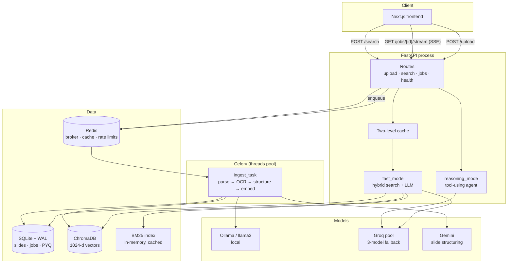
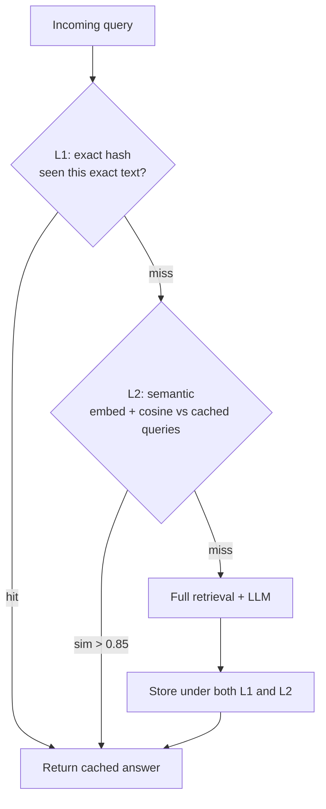

# ExamPrep AI — the backend / systems track

> How the machine actually works: what runs where, what breaks, and what I'd
> change at 100× the traffic.
>
> Companion to [`AI-RAG.md`](AI-RAG.md). This one is longer on purpose — it is
> the part interviewers probe hardest.

Every measurement cited here has an experiment behind it in `experiments/`.
Where something is **not** implemented, it says so plainly.

---

## 1. The whole system in one picture



**The one-sentence version:** uploads go onto a queue and are processed by
background workers; questions are answered synchronously from two indexes plus
an LLM; Redis coordinates everything that needs to be shared between processes.

### The two request paths

**Upload (slow, async).** Returns in milliseconds. The actual work — parsing,
OCR, an LLM call per slide, embedding — takes minutes and happens in a Celery
worker. The browser watches progress over SSE.

**Question (fast, sync).** Cache → hybrid retrieval (~95 ms) → LLM (1.3–12 s) →
answer. No queue, because the user is waiting.

> **Interview question: why are these different?**
> Because a request the user is waiting on must not be behind a queue, and a
> job that takes four minutes must not hold an HTTP connection. The split is
> about *who is waiting*.

---

## 2. FastAPI

### Why FastAPI

- **Async-native.** An answer spends most of its time waiting on an LLM. With
  `async def`, that thread serves other requests while waiting. With a
  synchronous framework the worker is blocked doing nothing.
- **Pydantic validation at the boundary.** Request bodies are validated before
  any handler runs, so bad input fails with a 422 instead of a `KeyError` three
  layers deep.
- **Automatic OpenAPI docs** — `/docs` is free and makes the API explorable.

### The thing worth understanding: async is only useful if you await

```python
@router.post("/search")
async def search(...):
    ...
    answer, model_used = await _call_llm(_SEARCH_SYSTEM, user_msg)
```

That `await` is what releases the thread. **But** the retrieval underneath is
synchronous CPU/GPU work — embedding, Chroma, SQLite. That does *not* yield.

So: this process handles many concurrent **LLM waits** well, and concurrent
**retrievals** poorly. That is a deliberate trade — retrieval is ~95 ms while
the LLM is 1.3–12 s, so the blocking part is ~1% of the request.

> **Interview trap:** "Is your API fully async?" — The honest answer is *"the
> I/O-bound parts are; retrieval is synchronous because it's CPU/GPU-bound and
> making it async wouldn't help — you'd still need the GPU."*

---

## 3. Celery — background work

### Why a queue at all

Ingesting one document is minutes of work. Three things follow:

1. The HTTP request cannot wait for it.
2. If the process restarts mid-way, the job must not vanish.
3. You want to control *how many* run at once, independently of web traffic.

A task queue gives all three.

### The configuration, and why each line exists

```python
task_acks_late=True,                # ack after completion (crash safety)
task_reject_on_worker_lost=True,    # re-queue if worker crashes mid-task
worker_prefetch_multiplier=1,       # fair scheduling across chains
worker_max_tasks_per_child=50,      # restart child after 50 tasks
```

- **`task_acks_late`** — by default Celery acknowledges a message when it
  *starts*. If the worker dies, the job is lost. Acking *late* means the broker
  keeps the message until the work finishes, so a crash re-delivers it. The
  cost: a task must be safe to run twice.
- **`reject_on_worker_lost`** — makes that re-delivery actually happen when the
  process is killed rather than exiting cleanly.
- **`prefetch_multiplier=1`** — a worker grabs one task at a time instead of
  hoarding a batch. Without it, one worker can reserve several long jobs while
  another sits idle.
- **`max_tasks_per_child=50`** — restarts the child process periodically. A
  blunt but effective guard against slow memory leaks in native libraries
  (OCR, torch).

### Retry classification — not all failures are equal

`jobs/tasks.py` distinguishes **transient** errors (network blip, rate limit,
database lock) from **permanent** ones (corrupt PDF, unsupported format).
Retrying a corrupt PDF forever just burns the queue; retrying a network timeout
usually works.

### Stale job recovery

If a worker is killed hard, its job can sit in `processing` forever. A recovery
pass (`jobs/recovery.py`) finds jobs whose worker is gone and marks them failed
so the UI stops lying about progress.

> **Interview question: what happens if a Celery worker crashes mid-task?**
> The broker never got an ack (`acks_late`), so the task is re-queued and
> another worker picks it up. If nothing picks it up, the recovery pass marks
> it failed rather than leaving it "processing" forever. The task is written to
> tolerate being re-run.

---

## 4. Redis — the shared brain

Redis is an in-memory key-value store. The reason it's here is **not** "it's
fast" — it's that **separate processes need a place to agree.**

### Concretely: the problem Redis solves here

Two Celery workers both want to call Gemini. The quota is 10 calls/minute,
globally. Each worker keeps its own counter:

```
Worker A: "I've made 5 calls, I'm fine."
Worker B: "I've made 5 calls, I'm fine."
Reality:  10 calls. Next one is a 429.
```

Neither is wrong locally. They need **one shared counter**, outside both
processes, that they can update atomically. That is Redis.

### What ExamPrep AI uses it for

| Role | Why Redis |
|---|---|
| **Celery broker** | The queue itself — durable handoff between API and workers |
| **Celery result backend** | Task state and results, expiring after 24h |
| **Distributed rate limiting** | One shared window across every worker |
| **Distributed semaphore** | Cap concurrent LLM calls process-wide |
| **Query cache (L1)** | Shared across processes, so one user's answer warms it for the next |

### TTL — the feature that makes cache invalidation tractable

Every Redis key can expire. That turns "when do I delete this?" — famously one
of the hard problems — into "how stale can this be?", which is answerable.

### Failure modes, honestly

| If Redis dies | What happens |
|---|---|
| Uploads | **Break.** No broker, nothing can be enqueued. |
| Questions | **Degrade.** The rate limiter and semaphore fall back to in-process versions (see the code), so the app still answers — but the limits are now per-process, not global. |
| Cache | Misses. Slower, still correct. |

That fallback is deliberate: **a cache or limiter outage should not be an
outage.**

### A real performance gotcha found in this project

From `routes/health.py`:

> Building a fresh Redis client per probe measured **~2.05 s**; a reused one
> takes **~0.4 ms**. The cost is not Redis — `localhost` resolves to IPv6 `::1`
> first, Redis is not listening there, and each new connection waits for that
> to time out before falling back to `127.0.0.1` (measured: 2053 ms via
> `localhost`, 29 ms via `127.0.0.1`).

> **Interview line:** "A health probe was taking two seconds. It wasn't Redis —
> it was `localhost` resolving to IPv6 first and waiting for a connection
> refusal. Setting `REDIS_URL` to `127.0.0.1` fixed it everywhere."

---

## 5. Rate limiting — and why atomicity is the whole game

### What it is

A cap on how often something may happen. Here: external API quotas. Exceed them
and you get 429s, which turn into failed jobs.

### The sliding window

A fixed window ("100 per minute, reset on the minute") allows 200 calls across a
minute boundary. A **sliding window** counts the last 60 seconds from *now*.

ExamPrep AI implements it with a Redis **sorted set**, scoring each call by its
timestamp:

```python
now = time.time()
window_start = now - self.window

pipe = r.pipeline(True)
pipe.zremrangebyscore(self._key, "-inf", window_start)   # drop old calls
pipe.zcard(self._key)                                     # count what's left
_, count = pipe.execute()

if count < self.max_calls:
    member = f"{self._worker_id}:{now}"
    r.zadd(self._key, {member: now})                      # claim a slot
    r.expire(self._key, int(self.window) + 5)
    return
```

Line by line: prune entries older than the window, count the rest, and if
there's room add yourself with the current timestamp as the score. `expire`
means an idle key cleans itself up.

### ⚠️ The subtle bug class — check-then-act

Look carefully. The prune-and-count is one pipeline; the `zadd` is a *separate*
command. Between them, another worker can also count and also decide there is
room. Both add. The limit is briefly exceeded.

**The semaphore in the same file does it correctly**, using a Lua script —
Redis runs Lua atomically, so nothing interleaves:

```lua
redis.call('ZREMRANGEBYSCORE', key, '-inf', stale_thr)
if redis.call('ZCARD', key) < max_c then
    redis.call('ZADD', key, now, holder)
    redis.call('EXPIRE', key, ttl)
    return 1
end
return 0
```

Prune, check and claim happen as one indivisible operation. **The right pattern
is in the codebase already** — the rate limiter simply predates it.

> **Interview gold:** this is a textbook check-then-act race, in real code, with
> the correct fix sitting next to it. "Where's a race condition in your system?"
> has a genuine answer: *"the rate limiter's count and claim aren't atomic; the
> semaphore's are, via Lua. I'd move the limiter to the same pattern."*

### Stale-holder cleanup

`ZREMRANGEBYSCORE` before the count is what prevents **deadlock**. If a worker
grabs a semaphore slot and is killed, its entry stays. Scoring entries by
timestamp and pruning anything older than the TTL means a crashed holder
releases itself automatically.

---

## 6. SQLite — and why it was the right call

### Why not PostgreSQL?

Because the workload is a single machine, a handful of workers, and 690 slides.
SQLite gives ACID transactions, zero configuration, zero network hop, and a
database that is one file you can copy. Postgres would add an operational
dependency for capacity we do not need.

**And this was measured, not assumed.** From `P5-sqlite-contention.md`, 960
transactions across 1–8 concurrent writers:

| Writers | txn/s | Failures |
|---|---|---|
| 1 | 70.3 | **0** |
| 4 | 76.3 | **0** |
| 8 | **91.2** | **0** |

Zero lock errors at any level. Put next to the LLM stage at 0.56 requests/second,
**SQLite processes ~163× more operations per second than the pipeline can
consume.**

### WAL mode

```python
cursor.execute("PRAGMA journal_mode=WAL")
cursor.execute("PRAGMA foreign_keys=ON")
cursor.execute("PRAGMA busy_timeout=30000")
cursor.execute("PRAGMA synchronous=NORMAL")
```

- **`journal_mode=WAL`** — Write-Ahead Logging. In the default rollback journal,
  a writer blocks readers. In WAL, writes append to a separate log, so
  **readers never block and a writer doesn't stop them.** Measured: at 8
  writers, WAL's worst-case latency was 1492 ms against the rollback journal's
  3122 ms — roughly half the tail.
- **`busy_timeout=30000`** — if the write lock is held, wait up to 30 s instead
  of instantly raising "database is locked". This single line removes most
  transient failures.
- **`synchronous=NORMAL`** — don't fsync on every commit. Slightly weaker
  durability against OS crash, meaningfully faster. Appropriate for derived
  data we can re-ingest.
- **`foreign_keys=ON`** — SQLite doesn't enforce FKs by default. It must be set
  per connection.

### `NullPool` — a non-obvious choice

```python
poolclass=NullPool,
```

Normally you pool connections. Here we deliberately don't: each thread gets a
fresh connection and closes it. SQLite connections are cheap, and sharing one
across threads is a source of subtle corruption. With a `threads` Celery pool,
`NullPool` is the safe default.

### Where SQLite would stop scaling

- **One writer at a time.** Fine at 91 txn/s; not fine at thousands.
- **Single machine.** No replication, no failover.
- **No network access.** Multiple API hosts cannot share it.

Those are the triggers for Postgres — and none of them apply yet.

---

## 7. Indexes

An index is a sorted lookup structure. Without one, finding rows means scanning
every row. With one, it's a tree descent.

The indexed columns here are the ones actually filtered on:

| Column | Why |
|---|---|
| `documents.file_hash` (unique) | Deduplication — "have I ingested this file before?" runs on every upload |
| `documents.subject`, `slides.subject` | **Every query is subject-filtered.** This is the hottest filter in the system |
| `slides.doc_id` | Fetch all slides for a document |
| `query_cache.query_hash` (unique) | The L1 cache lookup — must be fast or the cache is pointless |
| `pyq_matches.slide_id` | The composite PK is ordered `(pyq_id, slide_id)`, so it cannot serve a lookup *by slide*. This index exists precisely for the reverse direction |

That last one is the interesting one. **A composite primary key `(A, B)` gives
you an index usable for `A` and for `(A, B)` — but not for `B` alone**, the same
way a phone book sorted by surname can't find people by first name.

**The cost:** every index must be updated on every write, and takes disk. You
index what you filter on, not everything.

---

## 8. ChromaDB

A vector database stores embeddings and answers "which of these is nearest to
my query vector?"

**What's stored per slide:** the 1024-dim vector, the text, and metadata —
crucially `subject`, which lets the search filter *before* comparing vectors:

```python
dense_raw = chroma.query(
    query_embedding=query_vec,
    n_results=fetch_n,
    where={"subject": subject},      # metadata filter, applied in the search
)
```

Filtering inside the query, not after, is what keeps a CN question from ever
ranking a DBMS slide.

**Limitations:** approximate nearest neighbour (HNSW) trades exactness for
speed; it's a separate store to keep consistent with SQLite; and it embeds a
model choice — change the embedding model and **every vector must be rebuilt**,
because the old and new vector spaces are unrelated.

---

## 9. BM25 from a systems angle

BM25 needs an **inverted index**: a map from term → the documents containing it.
To find "congestion", you don't scan 690 slides; you look up one key.

ExamPrep AI builds it **in memory, per subject, and caches it**, keyed on a
SHA-256 digest of the corpus content:

```python
bm25, corpus_slides = _get_bm25_index(session, subject)
```

The digest matters. An earlier design keyed the cache on *counts* of slides,
which misses edits — re-ingesting a document with the same slide count but new
text would serve a stale index. Hashing the content means any change invalidates
it.

**Trade-off:** rebuilding on startup costs time (measured: 0.12 s for 690
slides — negligible) and memory grows with the corpus. At a much larger scale
you would move to a real search engine.

---

## 10. Caching — two levels, and why



- **L1** is a hash of the normalised query text. Exact repeats — a student
  re-asking the same thing, or hitting refresh — return instantly.
- **L2** catches paraphrases. "TCP congestion" and "congestion in TCP" hash
  differently but embed almost identically.

**Invalidation** is by content fingerprint: when a subject's slides change, its
cached answers are no longer valid. A cache keyed only on the query would serve
answers about deleted documents.

**Cache stampede** — if 50 users ask the same uncached question simultaneously,
all 50 miss and all 50 call the LLM. The standard fix is a lock so one fills
while the others wait. **Not implemented here** — at this traffic level it has
never been the binding constraint, and the distributed semaphore already caps
concurrent LLM calls, which blunts the worst case.

---

## 11. Concurrency — where it exists and where it must not increase

| Layer | Mechanism | Safe limit | Why |
|---|---|---|---|
| FastAPI | async event loop | high | LLM waits are I/O; they yield |
| Celery | `--pool=threads --concurrency=2` | **2** | see below |
| SQLite | WAL + busy_timeout | 8+ measured | not the constraint |
| Ollama | GPU-bound | **1–2** | a single request already saturates the GPU |
| Groq | 3-model round-robin | provider limits | rate-limited externally |

### The measured reason concurrency 2 is correct

From `P2-ollama-concurrency.md`: throughput peaks at concurrency 2 (0.56 rps,
1.27× over 1) and then **declines** while p50 latency grows 4.9×, because a
single request already occupies 97% of the GPU.

And instability above ~3 workers turned out **not** to be a concurrency problem
at all:

```
model requires more system memory (4.3 GiB) than is available (3.4 GiB)
```

It is **host RAM**. Ollama plus one embedder already occupies 5858 of 6144 MiB
of VRAM (95%), so a second embedder-holding process cannot fit.

> **Interview line:** "Raising worker concurrency made things worse, and the
> reason wasn't contention — it was that the model couldn't load. Measuring
> told me the limit was memory, not parallelism. More workers would have made
> it strictly worse."

---

## 12. Ollama and local inference

**Why run a model locally at all?** Ingestion makes one LLM call per slide —
690 calls for a corpus. Sending all of that to a paid API is expensive and
rate-limited. A local model costs nothing per call and has no quota.

**The trade:** it is slow (0.56 req/s measured) and shares the GPU with the
embedding model. That sharing is the real constraint — see §11.

**Where the GPU bites unexpectedly:** query embedding takes ~20 ms when the GPU
is busy and ~75 ms when it has been idle, because the GPU drops to 600 MHz from
a 2100 MHz maximum. Measured in `Q6-Q7-embedding-latency.md`. Quantisation and
batching cannot help something that is *waiting*, not computing — seven
optimisation candidates were tested and six rejected for this reason.

---

## 13. LLM provider fallback — a real outage

### The design

`engine/llm.py` keeps a pool of models with per-model rate accounting, picks one
round-robin, and falls back on failure.

### What went wrong

Two of the three configured Groq models were **decommissioned by the provider**
and began returning **404**. The pool caught `RateLimitError` and 429s — and
re-raised everything else:

```python
except APIStatusError as e:
    if e.status_code == 429:
        tracker.mark_blocked(60)
        continue
    raise                     # ← a 404 landed here
```

Measured impact: **4 of 6 consecutive calls failed (67%)**. Reasoning mode was
worse — `get_best_model_name()` returned the dead model with no round-robin to
rescue it, so it failed **100%** of the time.

### The fix

A 429 and a 404 are different in kind:

| | 429 | 404 |
|---|---|---|
| Meaning | too fast right now | this model no longer exists |
| Recovers on its own? | **yes**, in seconds | **never** — until config changes |
| Right response | block briefly, retry | retire it, fall through, and *tell someone* |

```python
if e.status_code == 404:
    tracker.mark_unavailable()
    continue
```

`mark_unavailable()` retires the model for the life of the process — retrying it
every round would burn a request and an exception each time.

Plus: `get_best_model_name()` never returns a model known to be dead, and
`GET /api/health/models` compares the configured ids against the provider's live
list, so the next retirement is visible **before** it breaks anything.

**Verified against the real provider: 6/6 calls succeed, where it was 2/6.**

> **Interview question: what happens when a model is decommissioned?**
> "It 404s. We treat that differently from a 429 — a rate limit is transient and
> the model should be retried; a 404 never recovers, so we retire it from the
> pool, fall through to the next model, and expose it on a health endpoint. The
> failure that taught us this took out two thirds of requests silently."

---

## 14. Server-Sent Events

Ingestion takes minutes. The browser needs progress.

```python
return StreamingResponse(
    ...,
    media_type="text/event-stream",
)
```

**SSE** is a long-lived HTTP response that the server keeps writing to. The
browser's `EventSource` reconnects automatically if it drops.

### Why SSE and not WebSockets

| | SSE | WebSockets |
|---|---|---|
| Direction | server → client only | both ways |
| Protocol | plain HTTP | upgrade handshake |
| Reconnect | automatic | you write it |
| Proxies | just works | sometimes fussy |

Progress updates flow **one way**. WebSockets would add bidirectional machinery
for a problem that isn't bidirectional.

**Limitations, honestly:** each open stream holds a connection; browsers cap
concurrent connections per origin over HTTP/1.1; and the current implementation
polls the database every ~2 s and pushes deltas, so the freshness floor is the
poll interval, not true push.

---

## 15. Security — what is implemented, and what is not

### ✅ Implemented

**Path-traversal protection on upload.** A filename like
`../../etc/passwd` must not escape the upload directory. Filenames are
sanitised and the resolved path is checked to stay inside the target directory.
There is a dedicated regression suite (`tests/test_security_regression.py`).

**Upload validation** — extension and type checks before anything is parsed.

**Rate limiting** — distributed, Redis-backed (§5), protecting external quotas.

**Secret handling** — API keys come from environment variables; `.env` is
gitignored; the readiness probe deliberately does not echo connection URLs.

**Subject isolation in retrieval** — every query is metadata-filtered, so one
subject's slides cannot surface in another's answers.

### ⚠️ Current limitations / future hardening

These are **not** implemented and should not be claimed:

- **No authentication or authorization.** The API assumes a single trusted user.
  Multi-user deployment needs auth before anything else.
- **No prompt-injection defence.** Slide text goes into an LLM prompt. A PDF
  containing "ignore previous instructions" is not filtered. The blast radius
  is limited (the model has no tools that mutate data in fast mode) but it is
  unmitigated.
- **CORS is permissive** for local development.
- **No upload size/rate cap per user**, because there are no users to
  distinguish.
- **Answers can cite documents that don't exist** — see `AI-RAG.md` §7. A
  correctness problem with a trust dimension.

> **Interview stance:** naming what is missing is stronger than pretending.
> "There's no auth — it's a single-user tool. If I deployed it multi-tenant,
> auth and per-tenant data isolation come before any feature work."

---

## 16. Reliability

| Mechanism | What it protects against |
|---|---|
| `acks_late` + `reject_on_worker_lost` | A worker dying mid-job losing the job |
| Retry classification | Wasting retries on permanently broken input |
| Stale job recovery | Jobs stuck in `processing` forever after a hard kill |
| `busy_timeout=30000` + backoff | Transient SQLite write contention |
| Readiness probe (`/api/health/ready`) | A container passing health checks while its dependencies are down |
| Model liveness (`/api/health/models`) | A decommissioned model silently failing 67% of requests |
| Lifecycle logging | Not knowing which phase a job died in |

The distinction between **liveness** and **readiness** is worth internalising:
liveness says "the process is running"; readiness says "it can actually serve
traffic". A container with a dead Redis is alive but not ready. Conflating them
means your orchestrator keeps routing traffic to something that fails everything.

---

## 17. Testing

**267 tests**, all hermetic — no network, no GPU, no API keys.

| Suite | What it pins down |
|---|---|
| `test_llm_model_fallback.py` | 404 falls back, 429 still blocks, 500 still raises |
| `test_security_regression.py` | Path traversal, and documented gaps staying documented |
| `test_rrf_batch_lookup.py` | Batched candidate lookup preserves exact fusion semantics |
| `test_rrf_determinism.py` | Same query → same order, regardless of `PYTHONHASHSEED` |
| `test_hybrid_search_stats.py` | The observability parameter is provably inert |
| `test_observability.py` | Logging can never break retrieval; no query text is stored |

### Why mock so heavily?

A test that calls Groq is not a test — it's a network check. It fails when the
provider hiccups, costs money, and is slow. **Stub the boundary, test your
logic.** The fallback suite proves the 404 path with a stub client that raises
whatever status you ask for; no key, no network, milliseconds.

### Test vs benchmark

| | Test | Benchmark |
|---|---|---|
| Asks | "is it correct?" | "how fast / how good?" |
| Result | pass/fail | a number |
| Lives in | `tests/` | `experiments/` |

Retrieval **quality** is a benchmark, not a test — it varies with the corpus and
has no pass/fail line. Retrieval **determinism** is a test. Mixing them gives
you a suite that fails for no reason.

---

## 18. Scaling to 100× — current vs future

**Current architecture is deliberately single-machine.** That is the right call
for one user with 15 documents, and it was validated by measurement rather than
assumed.

| Component | Today | At 100× | Trigger |
|---|---|---|---|
| **SQLite** | WAL, 91 txn/s measured, 0 failures | **PostgreSQL** | Multiple API hosts, or write contention actually appearing |
| **ChromaDB** | Embedded, local | **Qdrant / pgvector / managed** | Corpus beyond memory, or needing replication |
| **BM25** | In-memory, rebuilt per subject | **OpenSearch / Elasticsearch** | Rebuild cost becoming visible |
| **Redis** | Single instance | **Redis Cluster + persistence** | It becoming a single point of failure |
| **Celery** | 1 host, threads, concurrency 2 | **Many hosts**, queues split by task type | Ingestion backlog growing |
| **Uploads** | Local filesystem | **S3 / object storage** | More than one worker host — local disk stops being shared |
| **Local LLM** | Ollama on the dev GPU | **Dedicated inference host** (vLLM/TGI) | GPU contention with embedding — already the binding constraint |
| **Observability** | JSONL + logs | **OpenTelemetry + metrics + tracing** | Debugging across hosts |

### The honest ordering

If traffic actually grew 100×, the **first** thing to break is not the database
— it is the **GPU**, because ingestion is LLM-bound (AI cleanup is ~25× all
other indexing stages combined) and one process already saturates the card.

So the first move is separating **model serving** from **application serving**,
not swapping the database. Everything else is comfortable at this scale, and I
have the measurements to say so.

> **Interview line:** "I'd resist rewriting the storage layer. I measured
> SQLite at 91 transactions per second with zero lock failures, against an LLM
> stage that consumes 0.56 requests per second. The database has ~163× the
> headroom the pipeline can use. The bottleneck is GPU inference, so that's
> what I'd scale out first."

---

Next: [`INTERVIEW-QUESTIONS.md`](INTERVIEW-QUESTIONS.md) to test yourself, or
back to [`AI-RAG.md`](AI-RAG.md) for the retrieval side.
